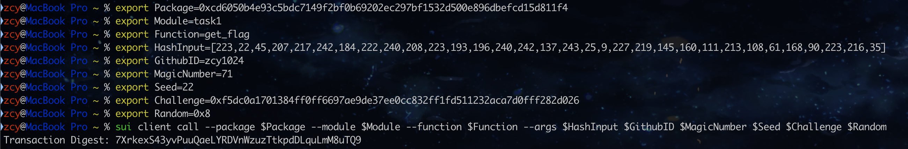

## 个人简介

- 工作经验: 1-2年
- 技术栈: `Move` `React` `Typescript` `Tailwindcss` `C++` `Rust` ...
- ~~半摆不摆，赖~~ 在Sui上学Move
- 联系方式: tg: `Debirth`

## 任务

### 01 Move CTF Check In
- [x] CLI call 截图: 
- [x] flag hash: 6b8fCTjfoKy9yvcGFb7MXvC6uXXoPSxfeoRM8z6k3q2N

### 02 Move CTF Lets Move
- [x] proof: [163,72,102,0]
- [x] flag hash: 5korJD1KWLAikydzJ5BKg7ErKiaBztzgFgC6XBC96Q1W